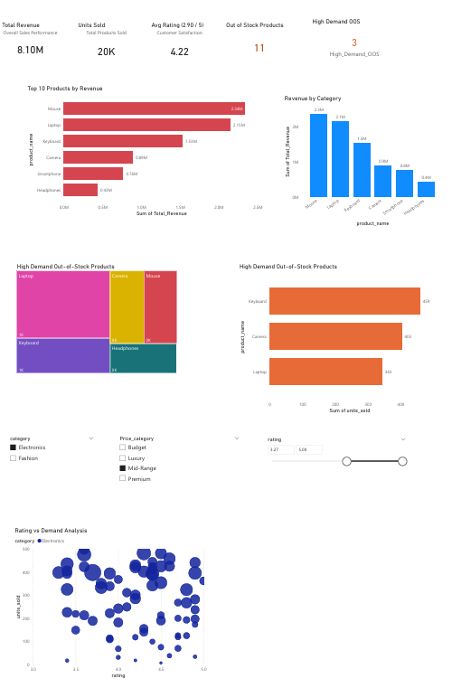

# 📊 Retail Sales Performance & Business Insights Dashboard

## 📌 Project Overview

This project analyzes retail sales data to uncover key business insights related to revenue, product performance, pricing strategy, and inventory management. An interactive Power BI dashboard was developed to help stakeholders monitor key performance indicators (KPIs), identify business opportunities, and make data-driven decisions.

The analysis focuses on:

* Revenue performance across products and categories
* Product demand and sales trends
* Pricing segment effectiveness
* Inventory risk and out-of-stock analysis
* Customer rating and product performance relationships

---

## 🚀 Tools & Technologies

* **Microsoft Power BI** – Interactive dashboard creation and data visualization
* **SQL** – Data querying, business analysis, and insight generation
* **Microsoft Excel** – Data cleaning, preprocessing, and feature engineering

---

## 📈 Key Business Insights

### 💰 Revenue Performance

* Total revenue generated: **₹18.9 Crores**
* Indicates strong overall business performance and healthy market demand.

### 🏆 Top Revenue-Generating Products

1. Laptop – **₹2.21 Cr**
2. Watch – **₹2.20 Cr**
3. Mouse – **₹2.03 Cr**
4. Smartphone – **₹1.99 Cr**
5. Backpack – **₹1.97 Cr**

These products contribute a substantial share of total revenue, highlighting key revenue drivers.

### 📦 Category Performance

* **Electronics** – ₹11.3 Cr (~60%)
* **Fashion** – ₹7.5 Cr (~40%)

Electronics is the dominant revenue contributor, suggesting stronger customer demand and market potential.

### 💎 Price Segment Analysis

* Luxury – **Highest units sold (~78K)**
* Premium – **~74K units**
* Mid-Range – **~67K units**
* Budget – **~29K units**

Higher-priced segments outperform lower-priced ones, indicating a customer preference for premium products.

### ⭐ Customer Rating vs Sales Performance

* Low-rated products – **₹7.19 Cr**
* Medium-rated products – **₹7.14 Cr**
* High-rated products – **₹4.57 Cr**

This suggests that pricing, brand value, and demand may influence sales more strongly than customer ratings alone.

### 🚨 Inventory Risk Insights

* Several products are currently out of stock.
* A subset of these products shows high demand, indicating potential lost revenue opportunities.
* This highlights the need for improved inventory planning and replenishment strategies.

### 📊 Revenue Concentration

A small group of products contributes a disproportionately large share of total revenue, following the Pareto principle. This presents opportunities to:

* Expand high-performing product lines
* Optimize inventory allocation
* Reduce overreliance on a few key products

---

## 📷 Dashboard Preview


---

## 📂 Project Structure

```text
retail-sales-performance-and-business-insights-dashboard/
│
├── data/
│   └── sales_data.xlsx
│
├── images/
│   └── dashboard_overview.png
│
├── powerbi/
│   └── retail_sales_dashboard.pbix
│
├── sql_queries/
│   └── analysis_queries.sql
│
└── README.md
```

---

## 🔍 Dashboard Features

* Executive KPI summary cards
* Revenue analysis by category and product
* Top-performing product identification
* Out-of-stock and high-demand inventory tracking
* Customer rating vs sales scatter analysis
* Interactive slicers for dynamic filtering

---

## 🎯 Business Impact

This dashboard enables businesses to:

* Monitor overall sales performance
* Identify top-performing products and categories
* Detect inventory shortages before revenue loss occurs
* Optimize pricing strategies
* Improve product and inventory decision-making

---

## 🧠 Key Skills Demonstrated

* Data Cleaning and Transformation
* Exploratory Data Analysis (EDA)
* SQL Query Writing and Optimization
* Data Visualization and Dashboard Design
* Business Insight Generation
* Inventory and Sales Performance Analysis

---

## 🎯 Conclusion

This project demonstrates how SQL, Excel, and Power BI can be used together to transform raw sales data into actionable business insights. It showcases the ability to combine technical analysis with business storytelling to support strategic decision-making.

The dashboard highlights critical areas such as revenue growth, product performance, pricing effectiveness, and inventory optimization—making it a practical solution for retail business analysis.

---

## 👤 Author

**Harshith Komanpally**

* GitHub: [https://github.com/Harshith-K259](https://github.com/Harshith-K259)
* LinkedIn: * LinkedIn: [LinkedIn Profile](https://www.linkedin.com/in/harshith-komanpally-29318a3ba/)