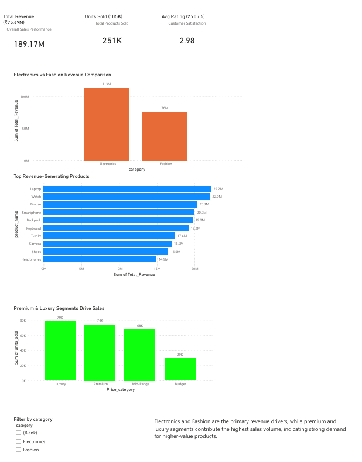

# 📊 Sales Data Analysis Dashboard

## 📌 Project Overview

This project analyzes sales data to uncover key business insights related to revenue, product performance, and pricing strategy.
An interactive dashboard was developed to help stakeholders monitor KPIs and make data-driven decisions

---

## 🚀 Tools & Technologies

* Microsoft Power BI
* SQL
* Excel

---

## 📈 Key Insights
📌 Total Revenue Generated
The dataset generated a total revenue of approximately ₹18.9 Crores, indicating strong overall business performance.

📌 Top Performing Products
The highest revenue-generating products are:
Laptop → ₹2.21 Cr
Watch → ₹2.20 Cr
Mouse → ₹2.03 Cr
Smartphone → ₹1.99 Cr
Backpack → ₹1.97 Cr
These products contribute a significant portion of total revenue.

📌 Category-wise Performance
Electronics → ~₹11.3 Cr
Fashion → ~₹7.5 Cr
Electronics contributes around 60% of total revenue, making it the dominant category.

📌 Price Segment Analysis
Luxury → Highest units sold (~78K)
Premium → ~74K units
Mid-Range → ~67K units
Budget → Lowest (~29K units)
Higher-priced segments show stronger sales, indicating customer preference toward premium products.

📌 Customer Rating vs Revenue
Low-rated products → ₹7.19 Cr
Medium-rated products → ₹7.14 Cr
High-rated products → ₹4.57 Cr
Revenue is higher for low and medium-rated products, suggesting factors like pricing and demand influence sales more than ratings.

📌 Revenue Concentration
A small group of products contributes a large share of total revenue, indicating reliance on top-performing items and opportunities to expand similar product lines.

---

## 📷 Dashboard Preview

---

sales-data-analysis-project/
│
├── dashboard/        # Power BI dashboard file (.pbix)
├── data/             # Raw dataset (Excel)
├── images/           # Dashboard screenshots
├── sql/              # SQL queries
└── README.md

---

## 📂 Project Structure

sales-data-analysis-project/
├── dashboard/
├── data/
├── images/
├── sql/
└── README.md

---

## 🎯 Conclusion

This project demonstrates how SQL and data visualization tools like Power BI can be used to transform raw data into actionable insights.
It highlights the importance of data-driven decision-making in identifying trends, optimizing product strategy, and improving business performance.